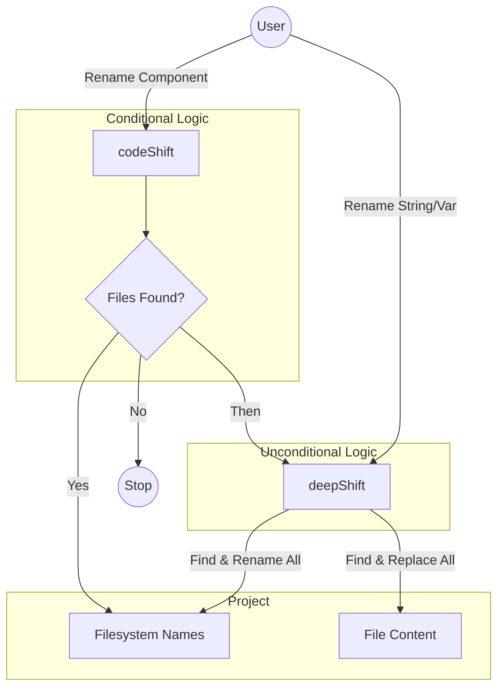

# codeShift

### Refactor at the speed of thought.

**codeShift** is a robust bash utility suite designed to take the fear out of project-wide refactoring. It separates the **Targeted Structural Refactor** (files/folders) from the **Global String Refactor** (variables/content).

---

## The Toolkit

### ❤️ codeShift: The Targeted Architect
**Trigger: Filesystem Match**

`codeShift` is smart. It scans your project tree. **If and only if** it finds files or directories matching your pattern, it initiates a refactor.

1.  **Scans** for `*pattern*` in filenames/dirnames.
2.  **Renames** those specific items.
3.  **Updates** documentation.
4.  **Calls** `deepShift` to fix references.

*Use this when moving or renaming specific components.*

### 🛠️ deepShift: The Global Engine
**Trigger: String Existence**

`deepShift` is brute force. It recursively scans everything. It does not care about structure; it cares about **text**.

1.  **Replaces** the string in **file content** (variables, imports, comments).
2.  **Renames** any **files** containing the string.
3.  **Renames** any **directories** containing the string.

*Use this for renaming variables, fixing typos, or disambiguating names globally.*

---

## The Decision Matrix

| Goal | Tool | Logic |
|------|------|-------|
| **Rename `User.ts` → `Account.ts`** | `codeShift` | You are targeting a specific file. |
| **Rename `src/utils` → `src/helpers`** | `codeShift` | You are targeting a specific directory. |
| **Rename `const userId` → `const accId`** | `deepShift` | **Crucial:** `codeShift` would fail here because no file is named `userId`. |
| **Fix typo `recieve` → `receive`** | `deepShift` | This is a text/string operation, not a file operation. |

---

## Architecture



## Installation

Source the scripts in your shell profile (`.bashrc` or `.zshrc`) to make them available globally:

```bash
# In your .bashrc or profile
source /path/to/codeShift/deepShift.sh
source /path/to/codeShift/codeShift.sh

# Optional: Add utility helpers
source /path/to/codeShift/utils/deepShiftIsPathIgnored.sh
```

## Safety First

Both tools are built with safety rails:
1. **Git Awareness:** Automatically respects `.gitignore` (unless you use `-n`).
2. **Loop Prevention:** Prevents infinite renaming loops.
3. **Identity Check:** Skips operations if `old_string` equals `new_string`.
4. **Structure Preservation:** Keeps file extensions intact during renaming.

> ⚠️ **Always commit your changes** before running a shift operation. Refactoring is a destructive operation.

---

*codeShift: Shift happens. Handle it intelligently.*
