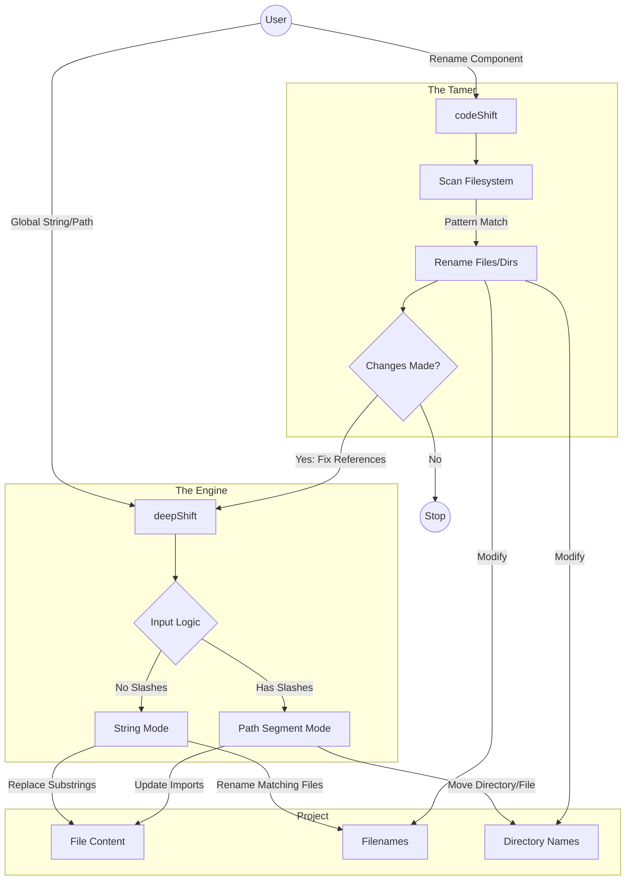

# DeepShift

### Refactor at the speed of thought.

**DeepShift** is a robust bash utility suite designed to take the fear out of project-wide refactoring. It is powered by **deepShift**, the global engine, and tamed by **codeShift**, the targeted architect.

You load it once, and the suite is at your fingertips.

## 📚 Navigation
*   **[🏠 Main README](./README.md)** (You are here)
*   **[🚀 deepShift Documentation](./deepShift.sh.README.md)** - The Global Engine
*   **[🦁 codeShift Documentation](./codeShift.sh.README.md)** - The Structural Tamer

---

## The Suite

### 🚀 deepShift: The Showrunner
**Trigger: Global String Existence OR Path Segments**

`deepShift` is the engine. It is the brute force behind the operation. It recursively scans everything. It cares about **data consistency** and **path integrity**.

**Quick Usage:**
```bash
# Renames 'userId' to 'accId' everywhere (files & content)
deepShift "userId" "accId"

# Moves a directory and updates all imports automatically
deepShift "src/auth" "src/security"

# Renames a specific file you dragged into the terminal
deepShift "src/components/OldButton.tsx" "NewButton"
```

**Capabilities:**
1.  **Replaces** strings in **file content** (variables, imports, comments).
2.  **Renames** any **files** containing the string.
3.  **Moves/Renames Paths** (Path Segment Mode):
    *   If you provide a path like `deep/deeper`, it handles the directory move AND updates references.
4.  **Smart Drag & Drop:** Detects if you provided a file path and "does the right thing" (renames the entity instead of the path).
5.  **Safety:** Built-in infinite loop prevention and gitignore awareness.

*Use this for renaming variables, fixing typos, moving directories, or disambiguating names globally.*

👉 **[Full deepShift Documentation & Advanced Usage](./deepShift.sh.README.md)**

---

### 🦁 codeShift: The Tamer
**Trigger: Filesystem Match**

`codeShift` is the tamer. It is the "allatidomar" (all-around tamer) of the suite. It controls the raw power of `deepShift` by restricting operations to specific structures.

**Quick Usage:**
```bash
# Finds files/dirs matching "Auth", renames them to "Security",
# then updates internal references automatically.
codeShift "Auth" "Security"
```

**Capabilities:**
1.  **Scans** your project tree for specific filename/dirname patterns.
2.  **Renames** only those specific structural items (Structural Shift).
3.  **Updates** documentation automatically.
4.  **Triggers** `deepShift` internally to fix global references *after* the structural change is confirmed.

*Use this when you need to move or rename specific components without affecting the whole world.*

👉 **[Full codeShift Documentation & Advanced Usage](./codeShift.sh.README.md)**

---

## The Decision Matrix

| Goal | Tool | Logic |
|------|------|-------|
| **Rename `const userId` → `const accId`** | `deepShift` | **Crucial:** This is a pure data/content operation. |
| **Rename `src/users/` → `src/members/`** | `deepShift` | **Path Segment:** You want to move a directory. `deepShift` handles path segments natively. |
| **Rename `src/utils/Log.ts` → `Logger`** | `deepShift` | **Smart Rename:** Drag the file in, give it a new name. It stays in the same folder. |
| **Rename `User.ts` → `Account.ts`** | `codeShift` | You are searching for a *pattern* ("User") in filenames to rename them to "Account". |
| **Fix typo `recieve` → `receive`** | `deepShift` | This is a text/string operation. |

---

## Architecture



## Installation

Installation is streamlined via the **loader**. Source a single file in your shell profile (`.bashrc` or `.zshrc`) to initialize the entire suite:

```bash
# In your .bashrc or profile
source /path/to/DeepShift/loader
```

Once loaded, both `deepShift` and `codeShift` (along with their utilities) are instantly available in your terminal.

## Safety First

Both tools are built with safety rails:
1. **Git Awareness:** Automatically respects `.gitignore` (unless you use `-n`).
2. **Loop Prevention:** Prevents infinite renaming loops.
3. **Identity Check:** Skips operations if `old_string` equals `new_string`.
4. **Structure Preservation:** Keeps file extensions intact during renaming.

> ⚠️ **Always commit your changes** before running a shift operation. Refactoring is a destructive operation.

---

*DeepShift: Shift happens. Handle it intelligently.*
