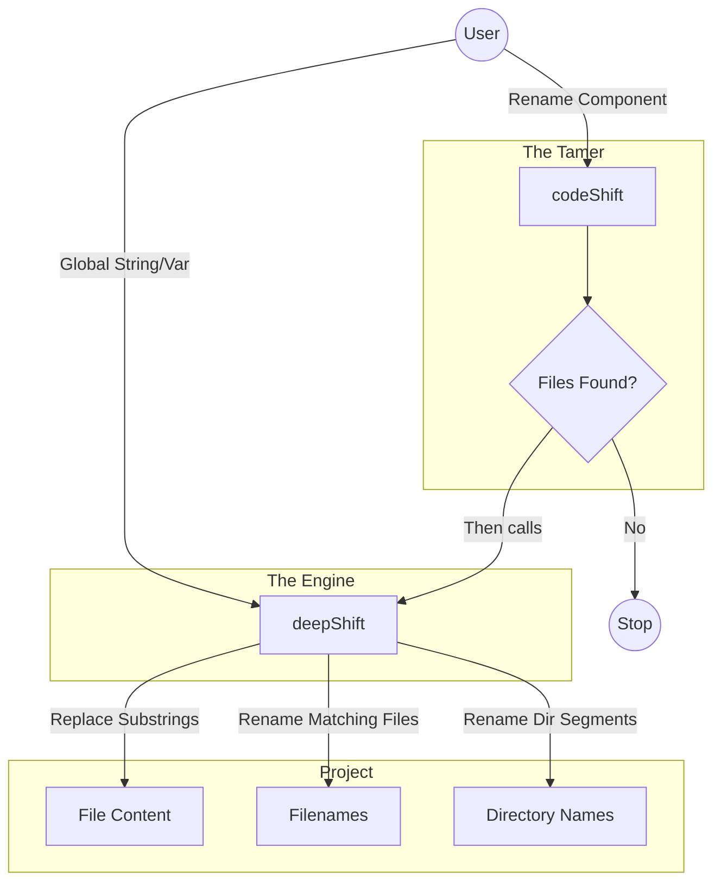

# DeepShift

### Refactor at the speed of thought.

**DeepShift** is a robust bash utility suite designed to take the fear out of project-wide refactoring. It is powered by **deepShift**, the global engine, and tamed by **codeShift**, the targeted architect.

You load it once, and the suite is at your fingertips.

---

## The Suite

### 🚀 deepShift: The Showrunner
**Trigger: Global String Existence**

`deepShift` is the engine. It is the brute force behind the operation. It recursively scans everything. It does not care about structure; it cares about **data consistency**.

1.  **Replaces** strings in **file content** (variables, imports, comments).
2.  **Renames** any **files** containing the string.
3.  **Renames** any **directories** containing the string.
    *   *Magic:* This effectively rewrites path segments. Renaming a directory from `user` to `member` updates the path for every file inside it (e.g., `src/user/api/` becomes `src/member/api/`).
4.  **Safety:** Built-in infinite loop prevention and gitignore awareness.

*Use this for renaming variables, fixing typos, or disambiguating names globally (files AND folders).*

### 🦁 codeShift: The Tamer
**Trigger: Filesystem Match**

`codeShift` is the tamer. It is the "allatidomar" (all-around tamer) of the suite. It controls the raw power of `deepShift` by restricting operations to specific structures.

1.  **Scans** your project tree for specific filename/dirname patterns.
2.  **Renames** only those specific structural items.
3.  **Updates** documentation automatically.
4.  **Calls** `deepShift` internally to fix references *after* the structural change.

*Use this when you need to move or rename specific components without affecting the whole world.*

---

## The Decision Matrix

| Goal | Tool | Logic |
|------|------|-------|
| **Rename `const userId` → `const accId`** | `deepShift` | **Crucial:** This is a pure data/content operation. `codeShift` would fail here. |
| **Fix typo `recieve` → `receive`** | `deepShift` | This is a text/string operation, not a file operation. |
| **Rename `src/users/` → `src/members/`** | `deepShift` | **Directory Renaming:** You want to rename a directory node. This updates the path for all children. |
| **Rename `User.ts` → `Account.ts`** | `codeShift` | You are targeting a specific file structure. |
| **Rename `src/utils` → `src/helpers`** | `codeShift` | You are targeting a specific directory structure. |

---

## Architecture



## Installation

Installation is streamlined via the **loader**. Source a single file in your shell profile (`.bashrc` or `.zshrc`) to initialize the entire suite:

```bash
# In your .bashrc or profile
source /path/to/DeepShift/loader
```

Once loaded, both `deepShift` and `codeShift` (along with their utilities) are instantly available in your terminal.

## Safety First

Both tools are built with safety rails:
1. **Git Awareness:** Automatically respects `.gitignore` (unless you use `-n`).
2. **Loop Prevention:** Prevents infinite renaming loops.
3. **Identity Check:** Skips operations if `old_string` equals `new_string`.
4. **Structure Preservation:** Keeps file extensions intact during renaming.

> ⚠️ **Always commit your changes** before running a shift operation. Refactoring is a destructive operation.

---

*DeepShift: Shift happens. Handle it intelligently.*
