# DeepShift

### Refactor at the speed of thought.

**DeepShift** is a robust bash utility suite designed to take the fear out of project-wide refactoring.

## 📋 Requirements
To run the DeepShift suite, ensure your environment meets the following criteria:

*   **Bash 4.0+**: Required for associative arrays (`declare -A`) used in loop prevention.
*   **Git**: Required for `.gitignore` parsing and repository safety checks.
*   **Standard Utilities**: `find`, `grep`, `awk`, `sed`.
    *   *Note for macOS users*: This suite uses GNU `sed` syntax (standard `sed -i`). If you are on macOS (BSD sed), ensure you have a compatible version or use `gnu-sed`.

## 📚 Navigation
*   **[🏠 EXAMPLES](./EXAMPLES.md)**  
*   **[🚀 deepShift](./src/deepShift/deepShift.sh.README.md)** - The Global Engine
*   **[🦁 codeShift](./src/codeShift/codeShift.sh.README.md)** - The Structural Tamer (Files & Dirs)
*   **[📂 dirShift](./src/dirShift/dirShift.sh.README.md)** - The Architect (Dirs Only)
*   **[🏠 README](./README.md)**

---

## The Suite

### 🚀 deepShift
**Trigger: Strings / Paths / Entities**
The brute force engine. Replaces strings globally, handles path moves, and smart renames files/dirs if targeted directly.
*Use for: Variable renames, fixing typos, explicit path moves.*

### 🦁 codeShift
**Trigger: Filesystem Patterns (Files & Dirs)**
The tamer. Scans for filenames matching a pattern and renames them, then updates references.
*Use for: Renaming components (e.g., `User.ts` -> `Account.ts`).*

### 📂 dirShift
**Trigger: Directory Existence**
The architect. Scans strictly for **directories** matching a pattern. It ignores files matching the name. After renaming the structure, it triggers `deepShift` to update imports and references.
*Use for: Renaming modules, folders, or architectural layers (e.g., `src/utils` -> `src/helpers`).*

---

## The Decision Matrix

| Goal | Tool | Logic |
|------|------|-------|
| **Rename `const userId` → `const accId`** | `deepShift` | Content operation. |
| **Rename `src/auth/` → `src/security/`** | `dirShift` | Explicit directory move (Calls deepShift). |
| **Rename ALL `utils` folders → `helpers`** | `dirShift` | Recursive directory pattern. |
| **Rename `User.ts` → `Account.ts`** | `codeShift` | File pattern match. |
| **Drag & Drop File Rename** | `deepShift` | Smart entity rename. |

---

## Architecture

```mermaid
graph TD
    User((User))
    
    subgraph "Scoped Triggers"
        CS["🦁 codeShift<br/>(If File/Dir Exists)"]
        DirS["📂 dirShift<br/>(If Dir Exists)"]
    end

    subgraph "The Engine"
        DS["🚀 deepShift<br/>(Global Replace)"]
    end

    subgraph "Impact Layer"
        subgraph "Filesystem Ops"
            FileRen["File Renames<br/>(User.ts → Acc.ts)"]
            DirRen["Dir Renames<br/>(utils/ → helpers/)"]
            PathMov["Path Segment Moves<br/>(deep/nested → flat/path)"]
        end
        
        subgraph "Content Ops"
            RefUp["Reference Updates<br/>(Imports/Variables)"]
        end
    end

    %% User Flows
    User -->|Global String/Path| DS
    User -->|Files & Dirs| CS
    User -->|Dirs Only| DirS

    %% deepShift Logic
    DS --> FileRen
    DS --> DirRen
    DS --> PathMov
    DS --> RefUp

    %% codeShift Logic
    CS -- "2. Update References" --> DS
    
    %% dirShift Logic
    DirS -- "2. Update References" --> DS
```



## Installation

Installation is streamlined via the **loader**. Source a single file in your shell profile (`.bashrc` or `.zshrc`) to initialize the entire suite:

```bash
# In your .bashrc or profile
source /path/to/DeepSeek/loader
```

## Safety First

Both tools are built with safety rails:
1. **Git Awareness:** Automatically respects `.gitignore` (unless you use `-n`).
2. **Loop Prevention:** Prevents infinite renaming loops.
3. **Identity Check:** Skips operations if `old_string` equals `new_string`.
4. **Structure Preservation:** Keeps file extensions intact during renaming.

> ⚠️ **Always commit your changes** before running a shift operation. Refactoring is a destructive operation.

---

<!-- Shift happens. Handle it intelligently. -->

