# DeepShift

### Refactor at the speed of thought.

**DeepShift** is a robust bash utility suite designed to take the fear out of project-wide refactoring.

## 📚 Navigation
*   **[🏠 EXAMPLES](./EXAMPLES.md)** (You are here)
*   **[🚀 deepShift](./deepShift.sh.README.md)** - The Global Engine
*   **[🦁 codeShift](./codeShift.sh.README.md)** - The Structural Tamer (Files & Dirs)
*   **[📂 dirShift](./dirShift.sh.README.md)** - The Architect (Dirs Only)

---

## The Suite

### 🚀 deepShift
**Trigger: Strings / Paths / Entities**
The brute force engine. Replaces strings globally, handles path moves, and smart renames files/dirs if targeted directly.
*Use for: Variable renames, fixing typos, explicit path moves.*

### 🦁 codeShift
**Trigger: Filesystem Patterns (Files & Dirs)**
The tamer. Scans for filenames matching a pattern and renames them, then updates references.
*Use for: Renaming components (e.g., `User.ts` -> `Account.ts`).*

### 📂 dirShift
**Trigger: Directory Existence**
The architect. Scans strictly for **directories** matching a pattern. It ignores files matching the name. After renaming the structure, it triggers `deepShift` to update imports and references.
*Use for: Renaming modules, folders, or architectural layers (e.g., `src/utils` -> `src/helpers`).*

---

## The Decision Matrix

| Goal | Tool | Logic |
|------|------|-------|
| **Rename `const userId` → `const accId`** | `deepShift` | Content operation. |
| **Rename `src/auth/` → `src/security/`** | `dirShift` | Explicit directory move (Calls deepShift). |
| **Rename ALL `utils` folders → `helpers`** | `dirShift` | Recursive directory pattern. |
| **Rename `User.ts` → `Account.ts`** | `codeShift` | File pattern match. |
| **Drag & Drop File Rename** | `deepShift` | Smart entity rename. |

---

## Architecture

```mermaid
graph TD
    User((User))
    
    subgraph "Scoped Triggers"
        CS["🦁 codeShift<br/>(If File/Dir Exists)"]
        DirS["📂 dirShift<br/>(If Dir Exists)"]
    end

    subgraph "The Engine"
        DS["🚀 deepShift<br/>(Global Replace)"]
    end

    subgraph "Impact"
        FS["Filesystem<br/>(Renames)"]
        Content["Content<br/>(References)"]
    end

    %% User Flows
    User -->|Global String/Path| DS
    User -->|Files & Dirs| CS
    User -->|Dirs Only| DirS

    %% deepShift Logic
    DS --> FS
    DS --> Content

    %% codeShift Logic
    CS -- "1. Rename Trigger" --> FS
    CS -- "2. Update References" --> DS
    
    %% dirShift Logic
    DirS -- "1. Rename Trigger" --> FS
    DirS -- "2. Update References" --> DS
    DirS -. "Explicit Move" .-> DS
```

